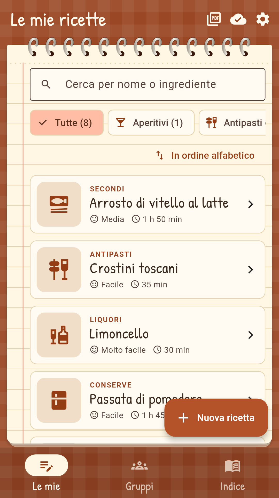
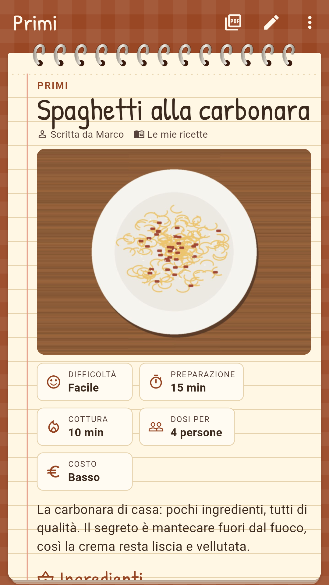
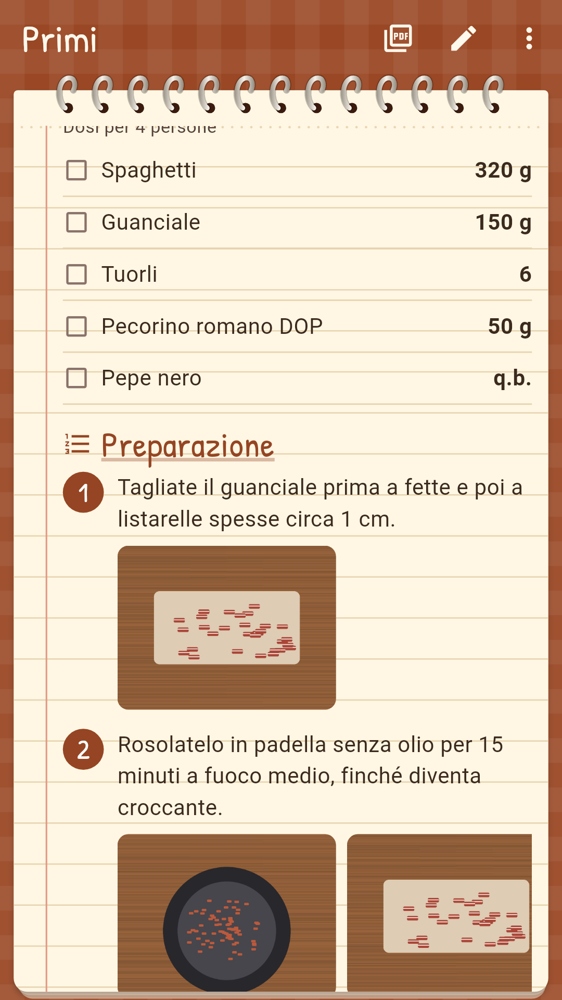
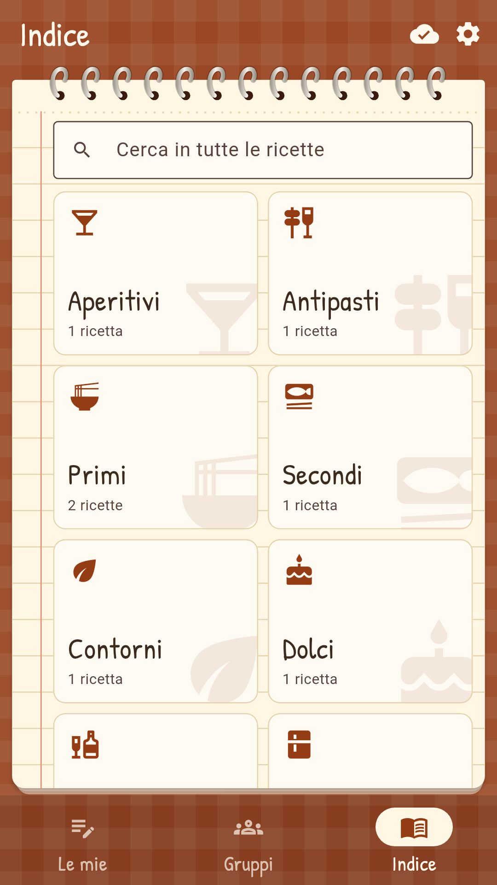
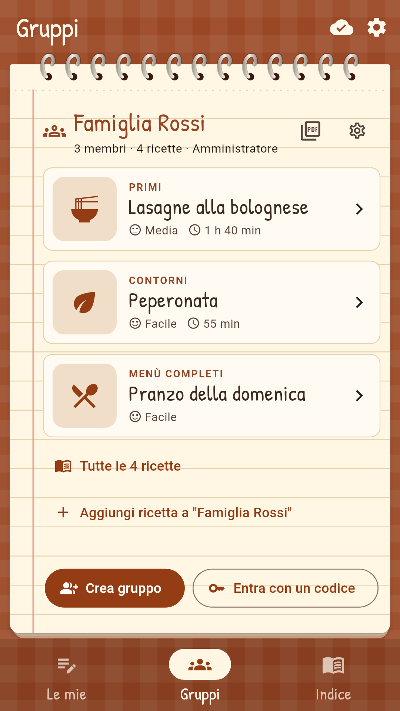
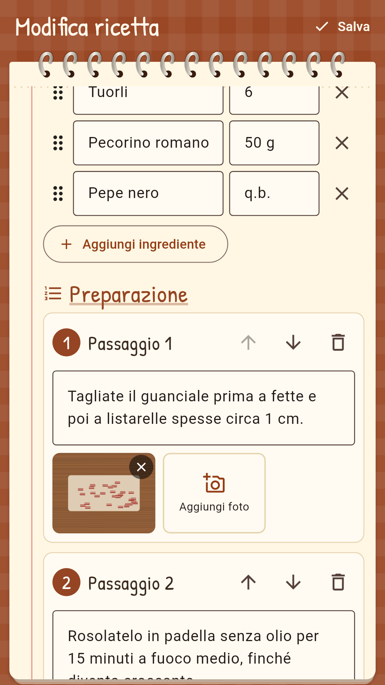
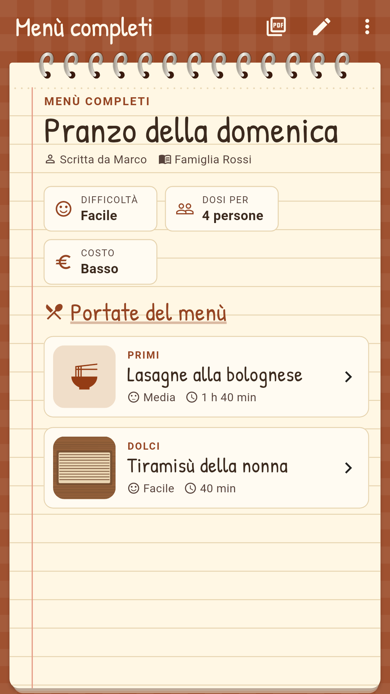

# FamilyRecipes

App Android/iOS (Flutter) per scrivere le ricette di famiglia, da soli o condivise in gruppi.
Nasce dalla base di [MyFleetManager](https://github.com/ViperoneDodge/myfleetmanager): stessi utenti,
gruppi, ruoli, amministratore, avvisi e sincronizzazione, ma per le ricette invece che per i veicoli.

| | | | |
|---|---|---|---|
|  |  |  |  |
|  |  |  |  |

## Funzioni

- **Categorie**: Aperitivi, Antipasti, Primi, Secondi, Contorni, Dolci, Liquori, Conserve, Menù completi
- **Scheda ricetta** in stile GialloZafferano: foto del piatto, presentazione, difficoltà, tempi di
  preparazione e cottura, dosi per N persone, costo, **ingredienti con le dosi**, **passaggi numerati**
  con **foto per ogni passaggio**, consigli e varianti
- Mentre si cucina si possono **spuntare gli ingredienti**; le foto si aprono a schermo intero con zoom
- **Menù completi**: un menù raccoglie le ricette delle singole portate (stesso ricettario)
- Tre schede: **Le mie** (ricette scritte da te, con ricerca e filtro per categoria), **Gruppi**
  (il ricettario di ogni gruppo), **Indice** (tutte le ricette visibili, per categoria, con ricerca
  anche negli ingredienti)
- **Esportazione PDF** di una **singola ricetta**, del **ricettario di un gruppo**, delle proprie ricette
  o di una categoria: impaginazione da ricettario con indice per categoria, foto e passaggi numerati
- **Gruppi** (famiglia, cugini, amici…) con codice invito e **QR**; ruoli **amministratore**,
  **può modificare**, **solo lettura** (chi entra con il codice parte in sola lettura)
- **Avviso** quando un altro membro aggiunge, modifica o elimina una ricetta in un gruppo
  (ad app chiusa controllo ogni ~15 minuti, senza server)
- Una ricetta di un gruppo si può **copiare tra le proprie**; le proprie si possono spostare in un gruppo
  (tieni premuta la ricetta)
- **Amministratore dell'app** (`appmyfleetmanager@gmail.com`, in `AppState.adminEmail` e `firestore.rules`):
  vede tutte le ricette e tutti i gruppi, cambia l'autore di una ricetta e i ruoli dei membri
- Login con **utente e password**, **email** o **account Google**; account solo telefono o online
- **Dati salvati sul telefono**: funziona anche senza internet, si sincronizza quando torna la rete
- Grafica da **blocco degli appunti** con spirale, carta crema e **colori caldi da libro di cucina**
  (terracotta, pomodoro, zafferano, oliva, cannella, vino, basilico, castagna), tovaglia a quadretti,
  fogli a righe/quadretti/puntini/lisci, tema chiaro/scuro/automatico
- Lingue: **italiano** e **inglese** (`assets/l10n/`)

## Foto

Le foto vengono ridotte a 1280 px (JPEG ~150–250 KB) e salvate sul telefono. Con l'account online ogni foto
è anche un documento Firestore in `books/{ricettario}/photos/{id}`: così basta il piano gratuito di Firebase
(non serve Firebase Storage, che richiede il piano a pagamento). Gli altri membri scaricano le foto la prima
volta che le aprono.

## Come si ottiene l'APK

La compilazione è automatica su GitHub (`.github/workflows/build.yml`). A ogni caricamento nel ramo `main`
GitHub prepara il progetto Android, controlla il codice, esegue i test, compila l'APK firmato e lo pubblica
nella pagina **Releases** come `FamilyRecipes-vX.Y.Z.apk` (più il file `.aab` per il Play Store se nei
Secrets ci sono le chiavi `UPLOAD_*`).

## Modalità solo telefono e modalità online

Finché `lib/firebase_config.dart` è vuoto l'app funziona **solo in locale** (account e ricette sul telefono,
niente gruppi). Per attivare login online, Google e gruppi serve un progetto Firebase gratuito:

1. https://console.firebase.google.com → *Crea progetto* (Google Analytics non serve).
2. **Authentication** → *Inizia* → attiva **Email/Password** e **Google**.
3. **Firestore Database** → *Crea database* → modalità produzione, regione `europe-west`.
   Nella scheda **Regole** incolla il contenuto di `firestore.rules` e pubblica.
4. *Impostazioni progetto* → *Aggiungi app* → **Android**:
   - nome pacchetto: `it.familyrecipes.familyrecipes`
   - **SHA-1**: `3A:89:11:94:87:CF:43:23:D8:39:38:56:38:F2:B8:11:10:5F:E1:14`
5. Scarica **google-services.json**, mettilo in `tool/google-services.json` e copia i valori in
   `lib/firebase_config.dart` (`apiKey`, `appId`, `messagingSenderId`, `projectId`, `storageBucket` e il
   *Web client ID* per Google). Al caricamento successivo GitHub compila la versione online.

Si può usare anche il progetto Firebase di MyFleetManager aggiungendo una seconda app Android con il nuovo
nome pacchetto: i dati restano separati (collezione `books` invece di `fleets`).

## Sviluppo

```sh
flutter create --org it.familyrecipes --project-name familyrecipes --platforms android,ios .
rm -f test/widget_test.dart
python3 tool/patch_android.py
flutter analyze && flutter test
flutter test tool/screenshots/screenshots_test.dart --update-goldens   # rigenera gli screenshot
```

## Firma dell'app

L'APK è firmato con `keystore/debug.keystore` (password `android`), così gli aggiornamenti si installano
sopra la versione precedente senza perdere i dati. Non cancellare questo file.
